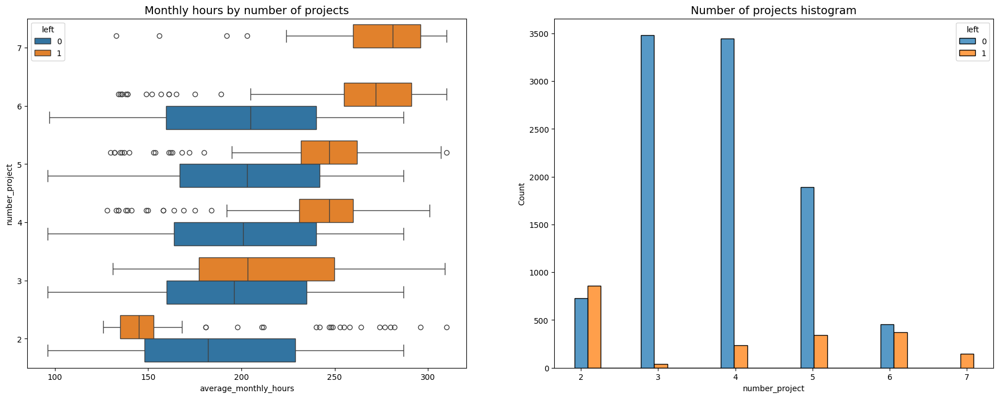
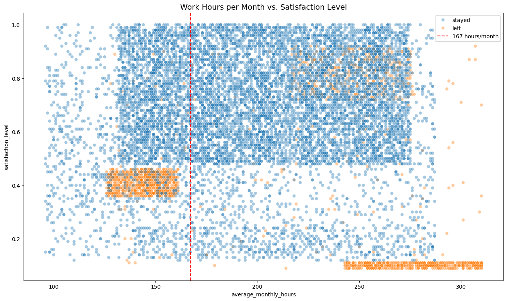
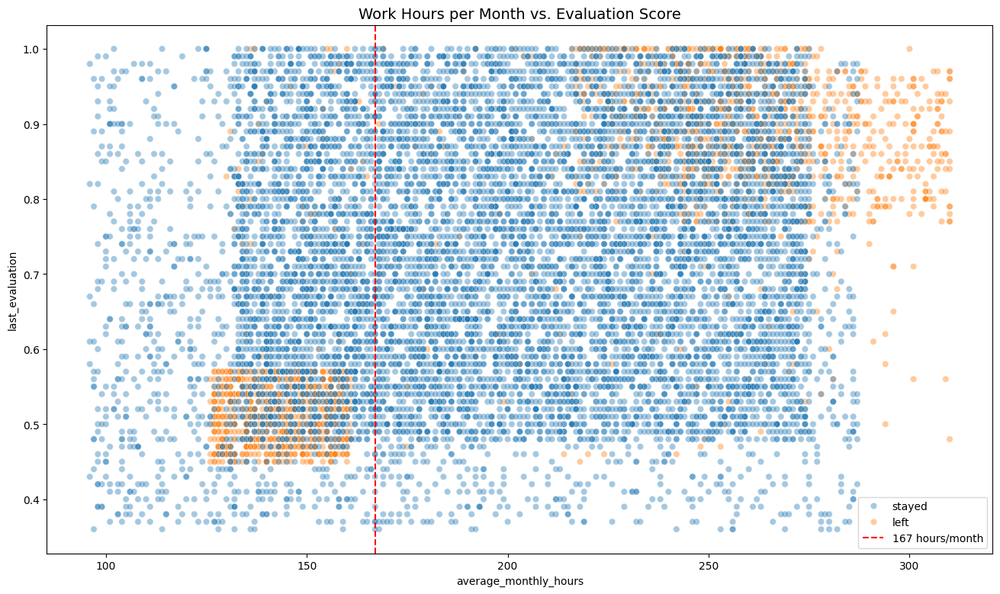
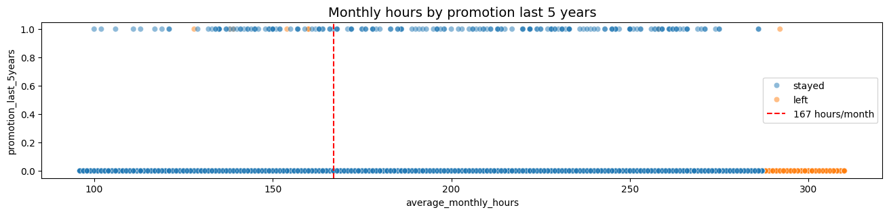
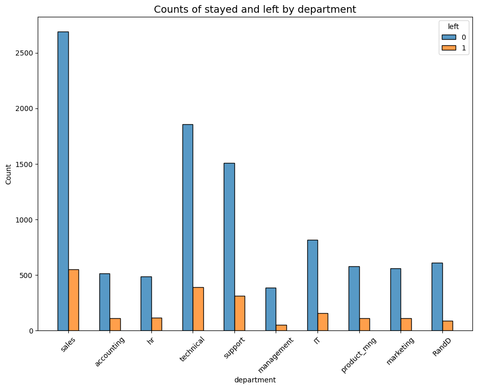
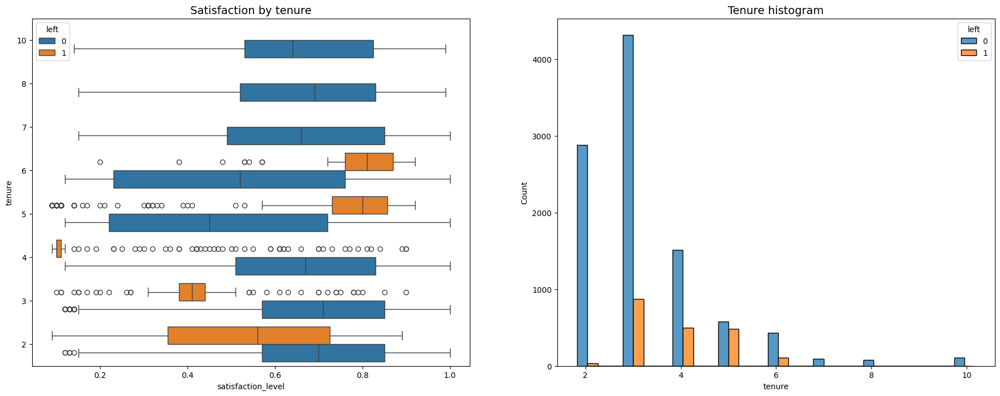
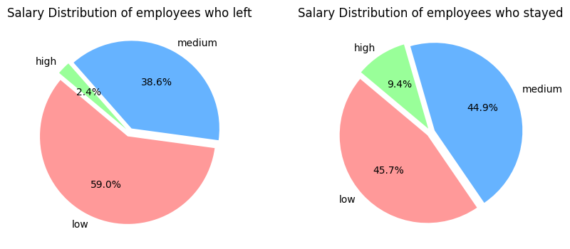
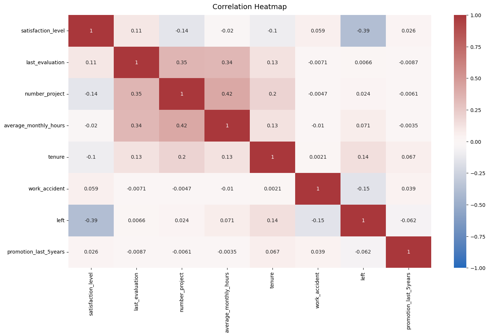
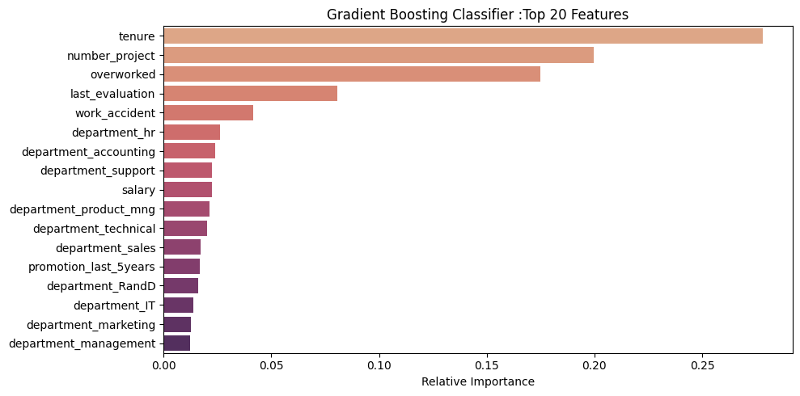
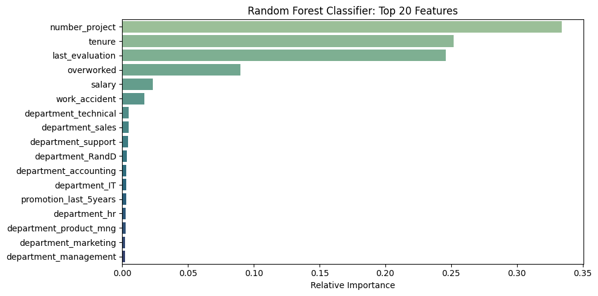

# Salifort Motors HR Analytics Capstone Project

## Introduction

This is the Capstone Project for Google Advanced Data Analytics.

Salifort Motors’ Human Resources (HR) department collected employee-related data to understand factors driving employee turnover. This capstone project uses that dataset to build predictive models and generate data-driven recommendations that help reduce employee attrition. By identifying key factors that contribute to employees leaving, HR can take proactive measures to improve retention, thereby saving time and resources associated with hiring and onboarding new staff.

## Table of Contents

- [Setup Notes](#setup-notes)
- [Business Problem](#business-problem)
- [Dataset](#dataset)
- [Project Structure](#project-structure)
- [Exploratory Data Analysis (EDA)](#exploratory-data-analysis-eda)
- [Feature Engineering &amp; Data Preparation](#feature-engineering--data-preparation)
- [Modeling](#modeling)
- [Results](#results)
- [Key Insights](#key-insights)
- [Data Source &amp; References](#data-source--references)

---

## Setup Notes

To install the required Python dependencies, run:

```
pip install -r requirements.txt
```

[**Salifort-Motors-HR-data-project.ipynb**](main/Salifort-Motors-HR-data-project.ipynb) is the main Jupyter notebook for this project. You can run all the cells directly — model fitting code is commented out, and pre-trained models are automatically loaded from local files in the repository (main/models/).

## Business Problem

Salifort Motors’ HR team wants to determine which factors correlate most strongly with employees leaving the company. The objectives are:

1. **Predict** whether an employee is likely to leave, based on available features.
2. **Identify** the most influential variables so HR can design targeted retention strategies.

A data-driven solution will help HR prioritize interventions (e.g., workload adjustments, career development opportunities, salary reviews) for employees at high risk of departure.

---

## Dataset

The original dataset contains 15,000 records and 10 columns. Key variables include:

| Variable                        | Description                                                                 |
| ------------------------------- | --------------------------------------------------------------------------- |
| **satisfaction_level**    | Employee-reported job satisfaction (0–1 scale).                            |
| **last_evaluation**       | Score from the employee’s most recent performance review (0–1).           |
| **number_project**        | Number of projects an employee works on.                                    |
| **average_monthly_hours** | Average hours worked per month.                                             |
| **time_spend_company**    | Tenure in years.                                                            |
| **Work_accident**         | Whether the employee ever had a workplace accident (0 = no, 1 = yes).       |
| **left**                  | Target variable: 1 if employee left; 0 otherwise.                           |
| **promotion_last_5years** | Whether the employee was promoted in the last five years (0 = no, 1 = yes). |
| **department**            | Employee’s department (e.g., sales, technical, hr).                        |
| **salary**                | Employee’s salary level (low, medium, high).                               |

**Note:** No local data download is required—data is accessed directly in the code notebooks.

---

## Project Structure

<pre>
Salifort-Motors-HR-data-project/
├── main/
│   ├── Salifort-Motors-HR-data-project.ipynb   # Main Jupyter notebook with data cleaning, EDA, modeling, and analysis
│   ├── HR_capstone_dataset.csv                 # Raw dataset
│   ├── Charts/                                 # Charts created in this project
│   └── model/                                  # Fitted models saved in pickle format
│
├── executive-summary.pdf                        # One-page, high-level summary
└── requirements.txt                             # Python dependencies
</pre>

---

## Exploratory Data Analysis (EDA)

In the early analysis phase, the following visualizations and observations were generated (all plots live in `main/Charts/`):

1. **Work Hous vs. Number of Projects**
   

- Employees working on more projects generally recorded more hours per month.
- Among those who **left**, two patterns emerged:
  1. Some worked **very few hours**, possibly already resigning or being phased out.
  1. Others worked **excessively long hours**, likely burned out and overworked.
- All employees who worked on **7 projects** eventually left the company.
- The **optimal workload** seems to be handling **3 to 4 projects**, where turnover was lowest.
- Most employees worked **well above the standard 167 monthly hours**, indicating widespread overwork, especially for those with 6-7 projects.

2. **Work Hours vs. Satisfaction**

   - A scatterplot of `average_monthly_hours` against `satisfaction_level` shows three clusters:
     1. Employees working around 210–280 hours/month with high satisfaction.
     2. Group with typical less working hours, but with satisfaction levels around 0.4. It’s difficult to determine why they *left*. One possible reason is the pressure to work longer hours, given that many of their peers worked significantly more. This pressure may have contributed to their lower satisfaction.
     3. Employees working extremely long hours (≥240 hours/month) with very low satisfaction.
   - These patterns hint that both underwork and overwork can negatively impact retention.
3. **Work Hours vs. Last Evaluation**

   - Most employees at this company work well over the average 167 hours per month.
   - There seems to be a relationship between hours worked and evaluation scores.
   - However, working long hours doesn’t always lead to high evaluation scores, as shown by the number of employees in the lower right quadrant.
   - Two groups of employees who left stand out: those who were overworked but performed well, and those who worked slightly below average hours with lower evaluation scores.
4. **Promotions & Hours Worked**

   - Among employees working the longest hours, few received promotions in the last five years.
   - Employees with promotions rarely left, indicating career advancement is a retention factor.
5. **Department Breakdown**
   

   - Employee counts by department show similar "stayed" vs. "left" ratios across most groups.
   - No single department exhibited disproportionately higher churn.
6. **Satisfaction vs. Tenure**

   - Long‐tenured employees who left had satisfaction levels comparable to long‐tenured stayers.
   - Among leavers, two clusters appear: very short‐tenured with low satisfaction, and medium‐tenured with unexpectedly low satisfaction.
   - Around four years of tenure, a dip in satisfaction for those who left suggests possible policy or management changes at that milestone.
7. **Salary Distribution**

   - Low‐salary employees account for ~60% of leavers versus ~46% of stayers.
   - High‐salary staff constitute only 2.4% of leavers but 9.4% of stayers, indicating salary levels affect turnover.
   - However, some low‐salary roles inherently have higher churn (frontline/support), so salary alone is not a definitive cause.
8. **Correlation Heatmap**

   - Strong positive correlations exist among `number_project`, `average_monthly_hours`, and `last_evaluation`.
   - Turnover (`left`) is strongly negatively correlated with `satisfaction_level`.

---

## Feature Engineering & Data Preparation

To mitigate potential data‐leakage issues—particularly concerns that `average_monthly_hours` and `satisfaction_level` might reflect post‐resignation behaviors—two main strategies were applied:

1. **Drop `satisfaction_level` completely** to avoid overly optimistic model performance if exit/survey timing is unknown.
2. **Create an “overworked” indicator**:

   - Define overwork as > 200 hours/month, based on common full‐time benchmarks (160–175 hours).
   - This binary feature captures excessive workload without leaking raw hours data.

Additional steps included:

- One‐hot encoding of categorical variables (department, salary).
- Train/test split (80/20) stratified on the `left` label.

Notes:
Modeling without Feature Engineering is also inculded in [**Salifort-Motors-HR-data-project.ipynb**](main/Salifort-Motors-HR-data-project.ipynb).

## Modeling

Three supervised classification algorithms were trained and tuned using cross‐validation:

1. **Decision Tree Classifier**
2. **Random Forest Classifier**
3. **Gradient Boosting (XGBoost) Classifier**

For each model:

- Grid search over hyperparameters (e.g., max depth, number of estimators, learning rate).
- Evaluation metrics: precision, recall, F1‐score, accuracy, and AUC.

A brief performance summary (on the training set) appears below.

| Model                  | Precision | Recall | F1‐Score | Accuracy | AUC    |
| ---------------------- | --------- | ------ | --------- | -------- | ------ |
| Decision Tree (CV)     | 0.928     | 0.900  | 0.914     | 0.9596   | 0.9772 |
| Random Forest (CV)     | 0.945     | 0.919  | 0.932     | 0.9679   | 0.9869 |
| Gradient Boosting (CV) | 0.936     | 0.929  | 0.932     | 0.9679   | 0.9861 |

Gradient Boosting Classifier slightly outperforms Random Forest by achieving a marginally higher F1‐score (0.9324 vs. 0.9317) and, more importantly, a better recall (0.9291 vs. 0.9193), meaning it catches more true leavers with only a negligible trade‐off in precision and AUC. *Since missing potential leavers is costy, Gradient Boosting Classifier is the preferred model for predicting who will leave.*

## Results

- **Best Model**: Gradient Boosting(implemented by XGBoost)

A brief performance summary (on the hold-out test set) appears below.

| Model                  | Precision | Recall | F1‐Score | Accuracy | AUC    |
| ---------------------- | --------- | ------ | --------- | -------- | ------ |
| Gradient Boosting (CV) | 0.928     | 0.934  | 0.931     | 0.9669   | 0.9556 |

- **Top Predictive Features** (XGBoost):
  1. **tenure**
  2. **number_project**
  3. **overworked** (derived from average hours)
  4. **last_evaluation**
  5. **work_accident**

As Random Forest also generates pretty good scores, we will also looking into its features importances.

- **Top Predictive Features** (Random Forest):
  1. nunber_project
  2. tenure
  3. last_evaluation
  4. overworked
  5. salary

Feature importance plots (stored in `results/figures/`) confirm that `tenure`, workload indicators(`number_projects` and `overworked`), and `last_evaluation` drive most of the predictive power.

## 🔍 Key Insights

1. **Tenure Has a Clear Impact**Employees with very short or very long tenure show different patterns. Those with around 4 years at the company often leave after a noticeable drop in satisfaction.
2. **Heavy Workloads Drive Turnover**Logging more than 200 hours per month significantly increases the risk of leaving. Overwork is a real issue. Better workload distribution and closer monitoring could help reduce burnout.
3. **Effort Doesn’t Always Equal Recognition**Putting in long hours doesn’t necessarily lead to strong performance reviews. When employees feel their effort isn't acknowledged, they're more likely to leave.
4. **Promotions Help Retain Talent**Very few employees who were promoted in the last five years ended up leaving. This shows how important growth opportunities are for keeping people engaged.
5. **Salary Matters—Especially at the Bottom**
   Employees in the lowest pay tier had the highest turnover. While some of this is expected in certain roles, offering clearer paths for advancement or slightly more competitive pay could help reduce unnecessary attrition.

---

## Data Source & References

- Original HR dataset (15,000 rows, 10 columns) sourced from Kaggle:[https://www.kaggle.com/datasets/mfaisalqureshi/hr-analytics-and-job-prediction](https://www.kaggle.com/datasets/mfaisalqureshi/hr-analytics-and-job-prediction)
- This README is built upon content and analysis recorded in the Jupyter notebook (see `Salifort-Motors-HR-data-project.ipynb`)

---
